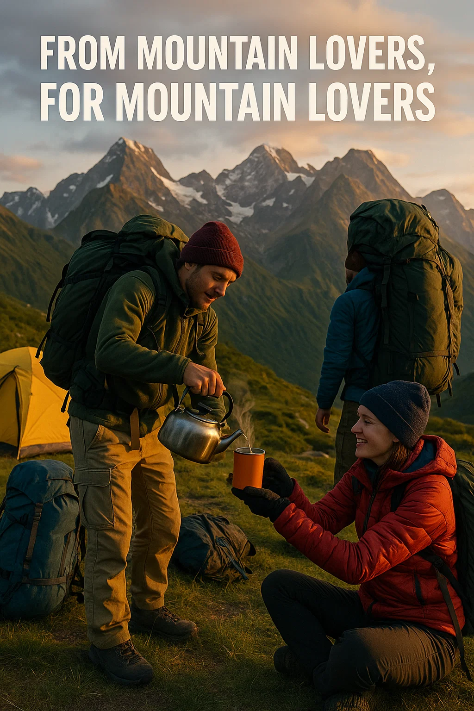

# LightPack Carpathian Adventures Website

> **Carry Less. Enjoy More.** - Mountain porter and logistics services in the Carpathians

A modern, responsive website for LightPack Carpathian Adventures, a mountain logistics company based in Sibiu, Romania, that provides gear transport and porter services for hikers exploring the Carpathian Mountains.



## 🏔️ About LightPack Carpathian Adventures

LightPack Carpathian Adventures helps hikers explore the Carpathian Mountains with less weight and more freedom. Born from a challenging 2022 Făgăraș Ridge crossing experience, we provide professional mountain porter and logistics services that allow adventurers to enjoy the trail without carrying heavy gear.

### Our Services
- **Gear Drops & Resupply**: Transport tents, sleeping bags, food, and water to agreed checkpoints
- **Porter Support**: Experienced mountain porters carry heavy loads across trails
- **Route Planning**: Expert advice on the best drop-off and pick-up points
- **Custom Logistics**: On and off-road logistics tailored to your adventure needs

## 🚀 Website Features

- **Responsive Design**: Optimized for desktop, tablet, and mobile devices
- **Single Page Application**: Smooth navigation with anchor-based routing
- **Contact Form**: EmailJS integration for inquiries
- **SEO Optimized**: Complete meta tags, structured data, and Open Graph tags
- **Analytics**: Google Analytics 4 integration with GDPR-compliant cookie consent
- **Performance**: Optimized images, CSS, and JavaScript for fast loading
- **Accessibility**: Keyboard navigation, screen reader friendly, semantic HTML

## 📁 Project Structure

```
lightpack_adventures_website/
├── index.html                 # Main HTML file with all page content
└── static/
    ├── css/
    │   ├── style.css         # Main stylesheet
    │   └── style-v1.css      # Legacy stylesheet
    ├── js/
    │   └── script.js         # Navigation, forms, analytics, and interactions
    ├── images/               # Website images and assets
    │   ├── from_to.webp     # Hero/OG image
    │   └── ...              # Other image assets
    ├── favicon.ico          # Browser favicon
    ├── favicon.svg          # SVG favicon
    └── setup-instructions.md # Detailed setup guide
```

## 🛠️ Technology Stack

- **Frontend**: Vanilla HTML5, CSS3, JavaScript (ES6+)
- **Styling**: CSS Grid, Flexbox, CSS Custom Properties
- **Forms**: EmailJS for contact form handling
- **Analytics**: Google Analytics 4 with gtag
- **Icons**: Custom SVG icons and Unicode symbols
- **SEO**: JSON-LD structured data, Open Graph, Twitter Cards

## 🔧 Setup & Installation

### Prerequisites
- Modern web browser
- Text editor (VS Code recommended)
- EmailJS account (for contact form)
- Web hosting service (optional for deployment)

### Local Development

1. **Clone or download the repository**
   ```bash
   git clone <repository-url>
   cd lightpack_adventures_website
   ```

2. **Open in browser**
   - Simply open `index.html` in your web browser
   - Or use a local server like Live Server (VS Code extension)

3. **Configure EmailJS** (for contact form functionality)
   - Sign up at [EmailJS](https://www.emailjs.com/)
   - Follow the setup instructions in `static/setup-instructions.md`
   - Update the EmailJS configuration in `static/js/script.js`

## 📧 Contact Form Setup

The website includes a fully functional contact form powered by EmailJS. To set it up:

1. Create a free EmailJS account
2. Configure your email service (Gmail recommended)
3. Create an email template for inquiries
4. Update the JavaScript configuration with your:
   - Public Key
   - Service ID  
   - Template ID

Detailed instructions are available in `static/setup-instructions.md`.

## 🎨 Customization

### Colors
The website uses CSS custom properties for easy color customization:

```css
:root {
    --primary: #2c5530;      /* Forest green */
    --secondary: #8b4513;    /* Saddle brown */
    --accent: #228b22;       /* Forest green accent */
    --neutral: #f5f5dc;      /* Beige */
    --white: #ffffff;
    --black: #333333;
    --gray: #666666;
    --light-gray: #f8f9fa;
}
```

### Content Updates
- Update text content directly in `index.html`
- Modify styles in `static/css/style.css`
- Add functionality in `static/js/script.js`

### Images
Replace placeholder images in the `static/images/` directory with your own photos.

## 🚀 Deployment

### Netlify (Recommended)
1. Create a Netlify account
2. Drag and drop the project folder to Netlify
3. Your site will be live instantly

### GitHub Pages
1. Create a GitHub repository
2. Upload project files
3. Enable GitHub Pages in repository settings

### Traditional Hosting
1. Purchase web hosting
2. Upload files via FTP or file manager
3. Configure domain if needed

## 🔍 SEO Features

- **Meta Tags**: Complete title, description, and keyword tags
- **Open Graph**: Facebook and social media sharing optimization
- **Twitter Cards**: Twitter sharing optimization  
- **Structured Data**: JSON-LD schema for local business
- **Sitemap Ready**: Clean URLs with anchor navigation
- **Mobile Friendly**: Responsive design with proper viewport meta tag

## 📱 Browser Support

- Chrome (latest)
- Firefox (latest)
- Safari (latest)
- Edge (latest)
- Mobile browsers (iOS Safari, Chrome Mobile)

## 🌍 Multi-language Ready

The website structure supports easy internationalization:
- Semantic HTML structure
- Separated content and styling
- Clean JavaScript architecture
- Meta tags ready for multiple languages

## 📊 Analytics & Privacy

- **Google Analytics 4** integration with event tracking
- **GDPR Compliant** cookie consent system
- **Privacy Focused** with user control over analytics
- **Event Tracking** for business goals and user interactions

## 🤝 Contributing

This is a business website for LightPack Carpathian Adventures. For suggestions or issues:

1. Contact us through the website form
2. Email: contact@lightpackadventures.com
3. Phone: +40 711 545 03

## 📄 License

This website is proprietary to LightPack Carpathian Adventures. All rights reserved.

## 📞 Contact Information

**LightPack Carpathian Adventures**
- **Location**: Sibiu, Romania
- **Email**: contact@lightpackadventures.com
- **Phone**: +40 711 545 03
- **Website**: https://lightpackadventures.com
- **Services**: Mountain porter and logistics services in the Carpathians

---

*From Sibiu to the high ridges of the Carpathians, we transport what you need so you can enjoy the climb, the view, and the freedom of the trail — without the weight on your back.*

**🏔️ Ready to plan your adventure? [Contact us](https://lightpackadventures.com#contact) today!**